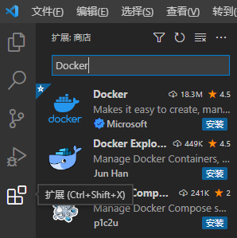
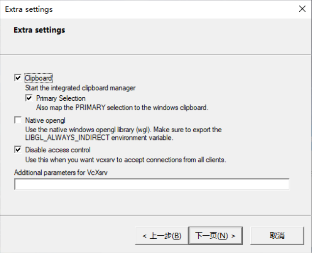
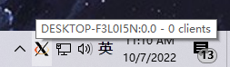
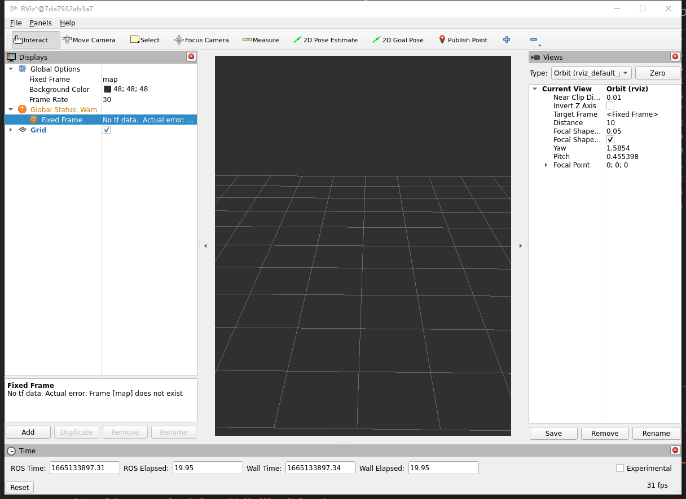
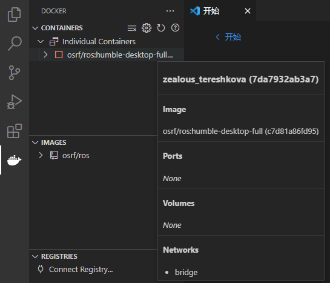

```{r setup, include=FALSE}
knitr::opts_chunk$set(echo = TRUE)
```

# How to set environment in Windows 10

It's highly recommended to follow this page even you have already download some components, because there will be some extra setting for those software to cooperate together.

## Docker Desktop

[Download Here](https://www.docker.com/products/docker-desktop/)

There are some points need to be mention:

### 1 Set Firewall rules

Docker Desktop will use WSL as Linux kernel, so we need to create TCP link between local machine and WSL.

1.  Search `firewall` in start menu and open `Windows Defender with Advanced Security`

2.  In the top left, click `Inbound rules`

3.  In the top right, click `New Rule`

4.  In the new page, select `Port` and then `Next`

5.  keep `TCP` and choose `Specific local ports` , set number `6000` . This is the specific port for WSL

6.  Go `Next` until last page.

7.  Setting Name of this rule in this page.

8.  Finish

### 2 Update WSL kernel

The auto-installed WSL may be out-of-dated. [*Click Here to update*](%5Bhttps://learn.microsoft.com/en-us/windows/wsl/install-manual#step-4---download-the-linux-kernel-update-package%5D(https://learn.microsoft.com/en-us/windows/wsl/install-manual#step-4—download-the-linux-kernel-update-package)) (See Step 4 to update)

## VS Code

[Download Here](https://code.visualstudio.com/)

We need to set Docker for vs code:

1.  open VS code, see the `tool bar` located in the left side.

2.  type `Docker` in the search bar

3.  Download first one (marked by Microsoft)

    

## ROS2

### 1 Download VcXsrc

1.  [*VcXsrv*](https://sourceforge.net/projects/vcxsrv/) (Click to download)

### 2 Open VcXsrc

1.  Open `XLaunch`

2.  In `Display settings`(Name of this window), go `Next`

3.  In `Client startup`, go `Next`

4.  In `Extra setting` , do like below, and go `Next`

5.  You can save configuration and next time just right click generated file and `open with` Xlaunch.

Now you should see XLaunch is running here.



### 3 Check IP address

1.  press `Win+R`

2.  type `cmd` and press `enter`

3.  type `ipconfig` check `IPv4` address, please remember this

### 4 Run ROS2!

1.  open `Windows power shell` , you can do that from `vscode` or use `shift+mouse right click` to call it.

2.  run command below

        docker run -it -e DISPLAY=<YOUR IP ADDRESS>:0 -e XDG_RUNTIME_DIR=/tmp/runtime-root osrf/ros:humble-desktop-full rviz2

3.  Now you should see this Window!

    

4.  Go to VScode and click docker icon in the left, you should see the container.
